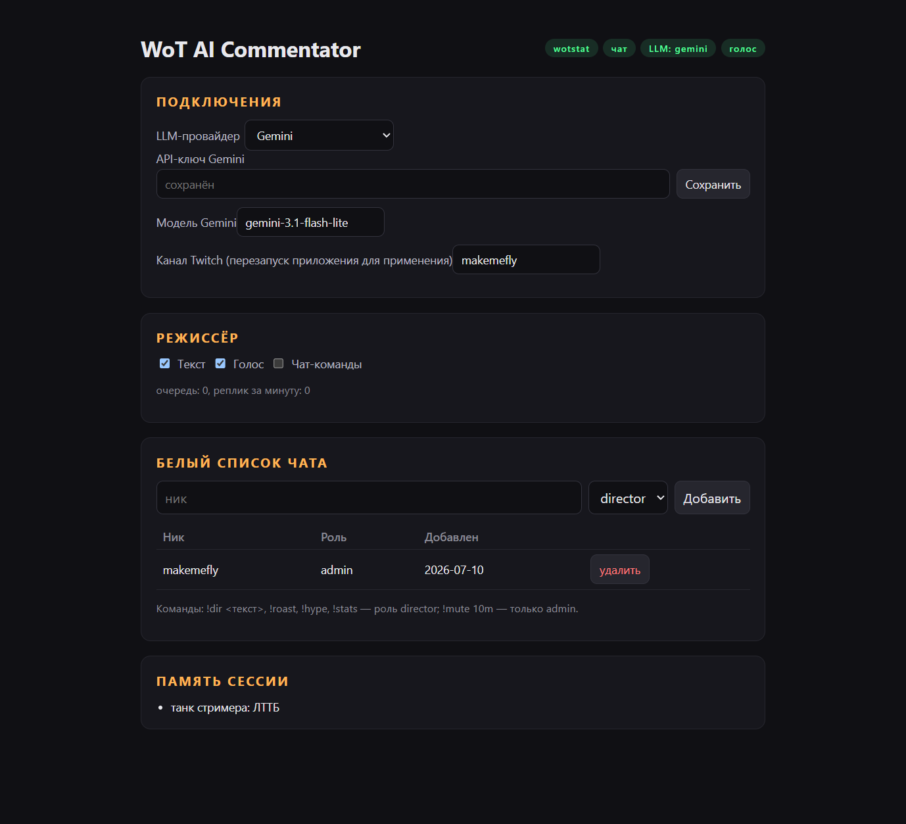

# Stream Director

AI-режиссёр стрима для «Мира танков» и League of Legends: получает события боя
из мода [wotstat-data-provider](https://github.com/wotstat/wotstat-data-provider)
(WoT) или из Riot Live Client Data API (LoL, работает из коробки — мод не нужен),
реагирует ехидными репликами (плашки в OBS + эмоциональный голос Chatterbox
Multilingual на видеокарте) и исполняет команды доверенных зрителей из чата Twitch.

## Установка (Windows)

1. Скачай `StreamDirector-vX.Y.Z-win64.zip` из
   [последнего релиза](https://github.com/Lakai4eg/wot-ai-commentator/releases/latest)
   и распакуй в любую папку. Python и Node.js ставить не нужно — всё в комплекте.
   Голосовой движок докачивается при первом старте (см. раздел «Голос»).
2. Запусти `StreamDirector.exe` — откроется консоль с логами, а панель сама
   откроется в браузере. При первом запуске SmartScreen может предупредить о
   неизвестном издателе: «Подробнее» → «Выполнить в любом случае».
3. **Мод** (только для WoT): скачай `wotstat.data-provider_<версия>.mtmod` из
   [релизов](https://github.com/wotstat/wotstat-data-provider/releases) и положи в
   `<папка игры>/mods/<версия игры>/`. Перезапусти игру.
4. **Ключ Gemini**: бесплатно в [Google AI Studio](https://aistudio.google.com/apikey)
   (из РФ нужен маршрут до `generativelanguage.googleapis.com` — VPN/pbr).
5. В панели вставь API-ключ Gemini (провайдер «Gemini» выбран по умолчанию),
   укажи канал Twitch. После сохранения ключа панель сама проверит LLM пробным
   запросом.
6. **OBS**: добавь http://127.0.0.1:8710/overlay как Browser Source на весь холст.

Готово: бейджи `чат`, `LLM` и `голос` в шапке панели зелёные, а `WoT`/`LoL`
загорится, как только запустится игра (активная отмечена ●) — иди в бой,
реплики пойдут сами. О новых версиях панель сообщит баннером со ссылкой.



## Обновление

При запуске `StreamDirector.exe` проверяет, вышла ли новая версия, и спрашивает,
обновляться ли. «Да» — скачает и перезапустится на новой; «Нет» — запустит
текущую и напомнит в следующий раз; «Отмена» — больше не будет предлагать
именно эту версию.

Настройки, API-ключ, база чата и голосовые модели живут в
`%LOCALAPPDATA%\StreamDirector` и обновлением не затрагиваются — модели
не перекачиваются.

**Переезд со старых версий (один раз).** Начиная с 0.6.0 состояние хранится
вне папки программы. Чтобы ключ, настройки и уже скачанные модели переехали
сами, распакуйте новый архив **поверх старой папки**. Если распаковать в новое
место, программа стартует с чистого листа и скачает модели заново.

## LLM-провайдеры

Кроме Gemini поддерживается любой OpenAI-совместимый API (переключается в панели
на лету): Groq (`https://api.groq.com/openai/v1`), OpenRouter, Mistral,
Ollama Cloud (`https://ollama.com/v1`), локальный Ollama
(`http://localhost:11434/v1`, без ключа).

## League of Legends

Отдельная настройка не нужна: Riot Live Client Data API поднимается самой игрой
на `https://127.0.0.1:2999` во время матча. Оба источника слушаются одновременно —
какая игра запущена, ту режиссёр и комментирует (бейджи WoT/LoL в панели,
активная отмечена ●).

## Голос

Озвучка работает на видеокарте NVIDIA (нужно 6+ ГБ VRAM). При первом старте
приложение само докачивает голосовой движок и модель — около 6.5 ГБ загрузки,
на диске стек занимает ~12 ГБ. Прогресс виден в панели (скачивание движка →
проценты весов → «разворачиваю в память видеокарты»), а бейдж `голос` в шапке
загорается зелёным, когда всё готово. Без подходящей видеокарты приложение
работает штатно — реплики идут только текстом на плашках OBS.

Свой голос можно добавить в секции «Голос» панели: WAV около 10 секунд чистой
речи, текст-транскрипт больше не нужен. «default» — собственный тембр модели без
референса.

Ударения расставляются автоматически (RUAccent), так что омографы вроде «за́мок»
и «дорога́» модель читает правильно.

LLM может ставить в начало реплики эмо-маркер (`(angry)`, `(excited)`,
`(sad)`, `(whispering)`) — он меняет интонацию озвучки, но зритель его на плашке
не видит.

Озвучка — модель Chatterbox Multilingual © Resemble AI, лицензия
[MIT](https://opensource.org/licenses/MIT); веса распространяются зеркалом
в Releases.

## Чат-команды

Единственная команда — `!dir <текст>`: заказ реплики режиссёру. Заказ
отрабатывает всегда: глобальный кулдаун и окно склейки игровых событий его
не задерживают (только пер-зрительский антиспам-кулдаун).

По умолчанию команда доступна никам из белого списка (роли `director`/`admin`
в панели). В открытом режиме («Команды всем») — любому зрителю, кроме роли
`banned`: она запрещает команды всегда.

## Разработка

Установка из исходников (Mac/Linux или без готового билда):

1. Python 3.12+ и Node.js 18+ (Windows: `winget install Python.Python.3.12 OpenJS.NodeJS.LTS`,
   в установщике Python — галочка «Add python.exe to PATH»).
2. `python -m pip install -e .` и `cd web && npm install && npm run build && cd ..`.
   Голосовой GPU-стек ставить вручную не нужно — приложение докачивает его при
   первом старте (нужна видеокарта NVIDIA; без неё голос просто недоступен).
3. Запуск: `python -m stream_director`, панель — http://127.0.0.1:8710/panel.

Сборка portable-дистрибутива: `python scripts/build_portable.py`
(Windows, нужен MSVC; `--skip-launcher` — без него). Релиз собирает CI
на тег `v*` (`.github/workflows/release.yml`).

```bash
cd web && npm run dev       # фронтенд с hot-reload (proxy на :8710)
```

Архитектура: `games/<игра>/client.py` (транспорт: WoT — WebSocket мода,
LoL — поллер Live Client API) → `games/<игра>/mapper.py` (события → стимулы)
→ `director.py` (очередь, окно склейки, кулдаун, LLM; игро-независим) →
`broadcast.py` (WS-оверлей + озвучка Chatterbox). Игро-специфичное (память,
`build_event`: стимул → факты для LLM) — в `games/<игра>/`, контракт модуля —
`games/base.py`.

Промпт комментатора = персона + формат ответа + игровой промпт + контекст боя +
событие. Заводские тексты — в `commentary/defaults.py`, правки из панели и
пресеты персон — в `db/prompts.py` (таблицы `personas`, `prompts`, `game_briefs`
в том же SQLite). Вторую половину игрового промпта — бриф под конкретный
танк/чемпиона — на старте боя пишет сама LLM (`commentary/brief.py`), править и
перегенерировать его можно в секции «Промпты» панели. Шаблонов реплик в проекте
нет: если LLM недоступна, комментатор молчит, а ошибка видна в бейдже `LLM`.

Рабочие данные (настройки, `chat-users.db`, журналы LoL) — в `data/`.
Спеки — в `docs/superpowers/specs/`.
